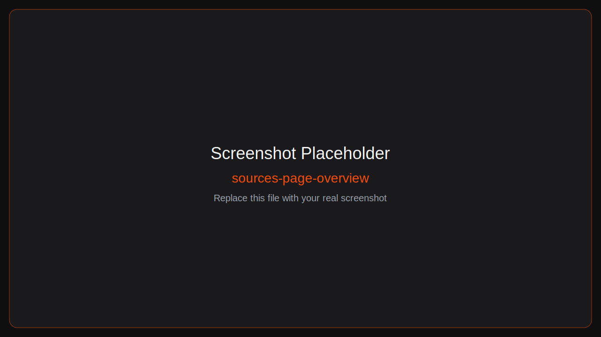
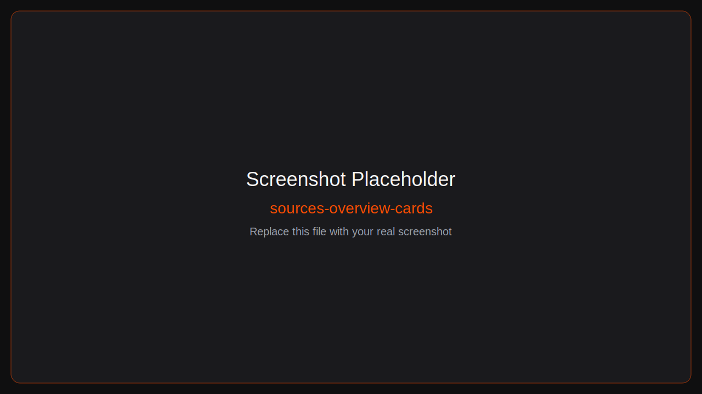
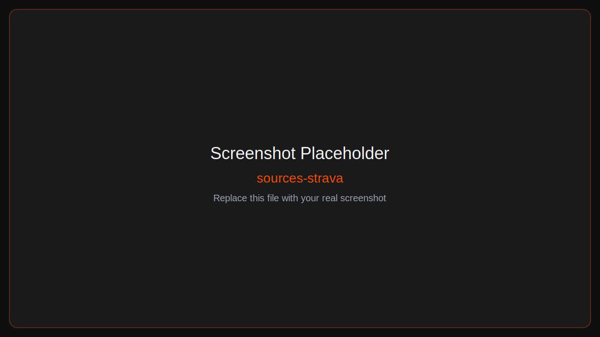
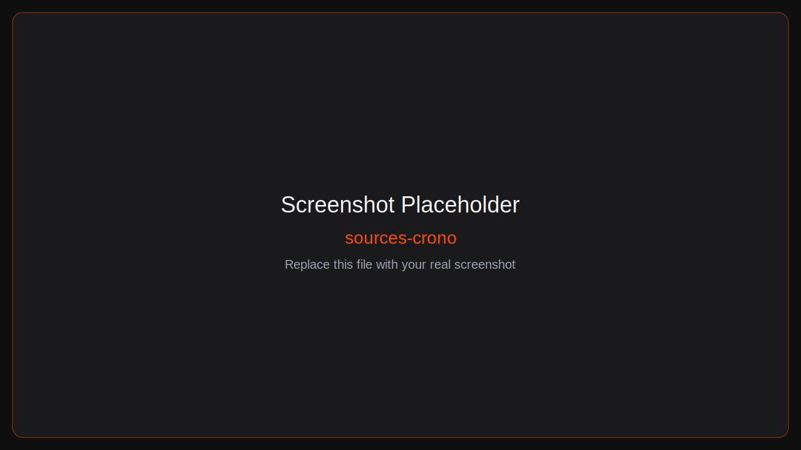
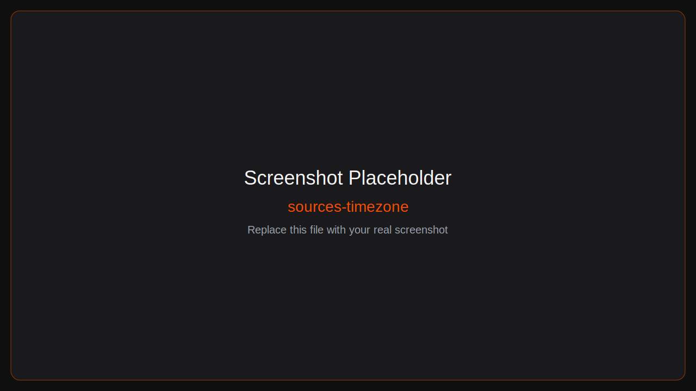
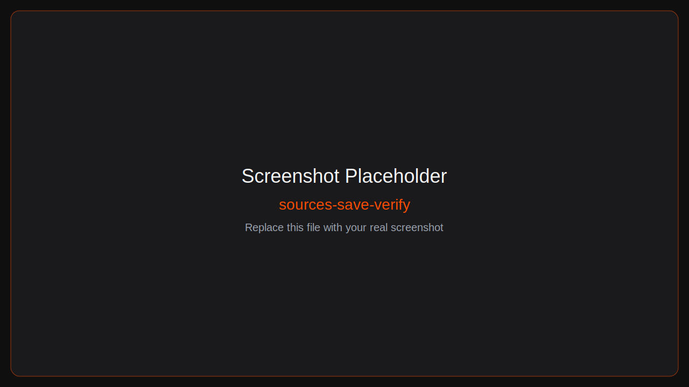

# Sources Setup Guide (Non-Technical)

This guide walks you through getting your credentials and connecting each source from the Chronicle `Sources` page:
- `http://localhost:1609/setup`

## Before You Start
- Chronicle is running (`docker compose up -d`).
- You can open `http://localhost:1609/setup` in your browser.
- You only need to configure the sources you actually use.



---

## Step 1: Open Sources Page
1. Open `http://localhost:1609/setup`.
2. You will see provider cards (Strava, Garmin, Intervals, Weather, Smashrun, Crono, etc.).
3. Fill fields and click **Save Setup**.



---

## Step 2: Strava (Required)
Where to get it:
- Strava API settings: https://www.strava.com/settings/api

Fields in `Sources`:
- `STRAVA_CLIENT_ID`
- `STRAVA_CLIENT_SECRET`
- `STRAVA_REFRESH_TOKEN` (usually filled by OAuth flow)
- `STRAVA_ACCESS_TOKEN` (usually filled by OAuth flow)

Recommended flow in Chronicle:
1. Enter `STRAVA_CLIENT_ID` and `STRAVA_CLIENT_SECRET`.
2. Click **Save Setup**.
3. Click **Connect Strava OAuth** inside the Strava card.
4. Approve access on Strava.
5. Chronicle stores tokens after callback.



Common issues:
- OAuth start fails: client id/secret not saved yet.
- Callback mismatch: verify your Strava app callback settings.

---

## Step 3: Garmin (Optional)
Where to get it:
- Your regular Garmin Connect account: https://connect.garmin.com/

Fields in `Sources`:
- `ENABLE_GARMIN` (toggle)
- `GARMIN_EMAIL`
- `GARMIN_PASSWORD`

Steps:
1. Enable Garmin toggle.
2. Enter your Garmin login email and password.
3. Save setup.


---

## Step 4: Intervals.icu (Optional)
Where to get it:
- Intervals: https://intervals.icu/
- API key and user id are in your Intervals account settings.

Fields in `Sources`:
- `ENABLE_INTERVALS` (toggle)
- `INTERVALS_API_KEY`
- `INTERVALS_USER_ID`

Steps:
1. Enable Intervals toggle.
2. Paste API key and user ID.
3. Save setup.


---

## Step 5: WeatherAPI (Optional)
Where to get it:
- Sign up and create a key: https://www.weatherapi.com/signup.aspx

Fields in `Sources`:
- `ENABLE_WEATHER` (toggle)
- `WEATHER_API_KEY`

Steps:
1. Enable Weather toggle.
2. Paste your WeatherAPI key.
3. Save setup.


---

## Step 6: Smashrun (Optional)
Where to get it:
- Smashrun API docs: https://api.smashrun.com/v1/documentation

Fields in `Sources`:
- `ENABLE_SMASHRUN` (toggle)
- `SMASHRUN_ACCESS_TOKEN`

Steps:
1. Enable Smashrun toggle.
2. Paste access token.
3. Save setup.


---

## Step 7: Crono API (Optional)
Where to get it:
- Project reference: https://github.com/seanap/crono-api

Fields in `Sources`:
- `ENABLE_CRONO_API` (toggle)
- `CRONO_API_BASE_URL` (example: `http://<your-ip>:8777`)
- `CRONO_API_KEY` (if your instance requires one)

Steps:
1. Enable Crono API toggle.
2. Enter base URL (and API key if required).
3. Save setup.



---

## Step 8: Timezone (General)
Field in `Sources`:
- `TIMEZONE` (example: `America/New_York`)

Use an IANA timezone value. Examples:
- `America/Los_Angeles`
- `America/Denver`
- `America/Chicago`
- `America/New_York`



---

## Step 9: Save and Verify
1. Click **Save Setup**.
2. Click **Reload**.
3. Verify status chips/messages are healthy.
4. Optional verification endpoints:
```bash
curl http://localhost:1609/health
curl http://localhost:1609/ready
curl http://localhost:1609/setup/api/config
```



---

## What Gets Saved
- `.env` is the canonical saved config.
- Chronicle also writes runtime setup overrides so changes apply immediately.

## Safety Notes
- Treat API keys/tokens/passwords as secrets.
- Do not post `.env` publicly.
- Rotate keys immediately if exposed.
